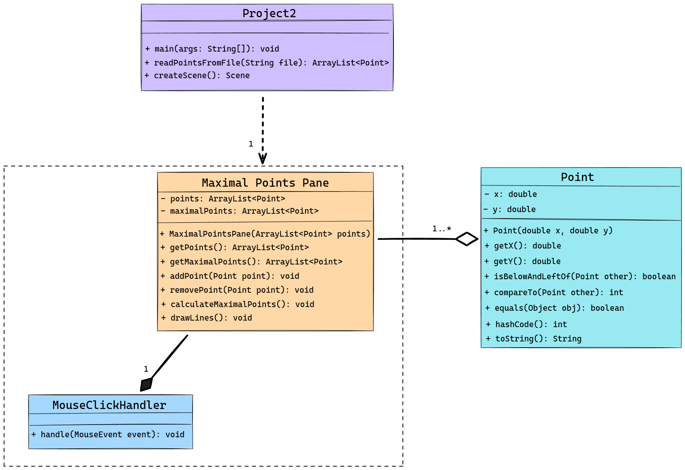

<!-- Title -->
<h1 align="center">Maximal Point Visualizer</h1>
<p align="center">

<i>The Maximal Point Visualizer is a JavaFX application designed to determine and visualize the set of maximal points among a given set of points in a 2D plane. A point is considered maximal if no other point is above it or to its right. The application reads points from a file, allows user interaction to add or remove points via mouse clicks, and dynamically updates the maximal points and their connections. Key features include dynamic point management, where points can be added with a left mouse click and removed with a right mouse click; maximal point calculation that identifies and visualizes maximal points by connecting them with lines; interactive visualization with color-coded points and hover functionality displaying coordinates; and a user-friendly interface that adapts to the addition or removal of points, ensuring an up-to-date graphical representation. This project leverages JavaFX for the graphical interface and includes a robust backend for point management and maximal point calculations, providing a clear and interactive way to explore the concept of maximal points in computational geometry.
</i></p>

---

<h2 align="center">Tech Used 🧰</h2>

<!-- Tech Stack -->
<p align="center">
<kbd>
<a href="https://www.java.com/en/">
    
  </a> | <a href="https://makefiletutorial.com/">
    
  </a> | <a href="https://git-scm.com/">
    
  </a>
  
  </kbd>
</p>

## User Guide 📔

This guide provides instructions on how to set up and run the project using two different methods: Cloning the repository and downloading the project as a ZIP file.

### Prerequisites

Before you begin, ensure you have the following installed:

- Java JDK
- [JavaJX](https://openjdk.org/) (Note: JavaFX is required to run the project. Download and install it before proceeding. Place the JavaFX .jar files in a `lib` directory at the root of the project.)
- Git (for cloning the repository)

### File Structure

<details>
<summary><b>See File Tree</b></summary>

The suggested file structure for your project is as follows:

```

.
└── maximal_point_visualizer/
    ├── bin/
    │   ├── docs/
    │   │   └── points.txt
    │   ├── main/
    │   │   └── .class files
    │   └── test/
    │       └── .class files
    ├── lib/
    │   └── javafx.jar files
    ├── public/
    │   └── project2_uml.png
    ├── src/
    │   ├── main/
    │   │   ├── Controller.java
    │   │   ├── main.fxml
    │   │   ├── MaximalPointsPane.java
    │   │   ├── Point.java
    │   │   └── Project2.java
    │   └── test/
    │       ├── GeneratePointsFile.java
    │       ├── MaximalPointsPaneTest.java
    │       ├── PointTest.java
    │       ├── Project2Test.java
    │       └── TestRunner.java
    ├── .gitignore
    ├── Makefile
    └── README.md

```

</details>

### Option 1️⃣ : Cloning the Repository

1. **Clone the Repository**

   Open your terminal and run the following command to clone the repository: **`git clone git@github.com:sllozier/maximal_point_visualizer.git`**

2. **Navigate to the Project Directory**

    Once the repository is cloned, navigate to the project directory: **`cd path/to/maximal_point_visualizer`**

3. **Using the Makefile**

    - To generate text files, compile the project, run tests, and then run the project code (if tests pass), use: **`make all`**

    - To only generate the text files, use: **`make generate_txt_file`**

    - To run tests (this will also generate text files), use:**`make run_tests`**

    - To run the project code (this will also generate text files), use:**`make run_project`**

    - To clean up and remove generated files, use: **`make clean`**

### Option 2️⃣ : Downloading the ZIP File

1. **Download the Project**

    Go to the repository page on GitHub (or relevant hosting service), and click on the **`Download ZIP`** button. Save the ZIP file to your desired location and extract it.

2. **Navigate to the Project Directory**

    Open your terminal and navigate to the extracted project directory: **`cd path/to/extracted/maximal_point_visualizer`**

3. **Using the Makefile**

    Follow the same steps as in **Option 1** for using the Makefile.

---

*Remember to replace **`[repository URL]`** and **`path/to/maximal_point_visualizer`** with the actual URL of your repository and the path to the **`maximal_point_visualizer`** directory in your local system. This guide assumes that the Makefile is located in the **`maximal_point_visualizer`** directory and is set up as previously discussed.*

---

## Approach

For this project, I developed a JavaFX application to determine and visualize the maximal points in a 2D plane. The application reads a set of points from a file and dynamically updates the maximal points based on user interactions. The project consists of three main classes: `Point`, `MaximalPointsPane`, and `Project2`.

- **Point:** An immutable class representing a point with x and y coordinates, implementing the Comparable interface. It includes methods for coordinate retrieval and comparison, and a method to determine if another point is below and to the left.
- **MaximalPointsPane:** Extends the JavaFX Pane class, manages the set of points, and calculates maximal points. It includes methods to add or remove points via mouse clicks and draw lines connecting maximal points. Hover functionality highlights points and displays their coordinates.
- **Project2:** Defines the scene containing the pane, reads the initial set of points from a file, and integrates with the JavaFX application.

I began by analyzing the problem and planning the class structure. I used a test-driven approach, making sure each component functioned correctly before integration. My testing validated the logic, and debugging ensured the visualizer displayed points and lines accurately. The final application combines interactive graphics with robust data handling, providing a clear visual representation of maximal points.

## Assumptions

For the development of the Maximal Point Visualizer, several assumptions were made to streamline the implementation and make sure the project's requirements were met. It is assumed that the input file containing the points is formatted correctly, with each line containing two floating-point numbers representing the x and y coordinates, respectively. The application presumes a static pane size of 500x500 pixels, though it dynamically adjusts the visualization based on the window's size. Mouse interactions are assumed to be standard, with left-clicks adding points and right-clicks removing points. It is also assumed that the JavaFX environment is properly set up and configured for the application to run without issues. These assumptions allowed for focused development on the core functionalities of point management and maximal point visualization.

## Lessons Learned

A part of my learning disability involves switching opposite terms, which affected the initial logic of the program. I kept swapping left and right, as well as up and down, leading to errors in the `isBelowAndLeftOf` method. This also caused my testing logic to be incorrect, making debugging more challenging. I relied on the given points and image in the instructional PDF to guide me and observed the behavior of the code in the graphical interface. This visual feedback helped me realize the directional swaps. Once I identified the issue, I adjusted the logic and testing accordingly, resulting in a properly functioning program. This experience emphasized the importance of visual validation and iterative debugging.

## Possible Improvements

There are several ways to enhance the current implementation of the maximal point visualizer. One improvement would be to optimize the algorithm for calculating maximal points to handle larger datasets more efficiently. This could involve implementing a more sophisticated algorithm or using data structures that reduce the computational complexity. Additionally, enhancing the user interface with features such as zooming and panning would provide a better user experience when dealing with larger sets of points. Another improvement could be adding functionality for saving and loading different sets of points, allowing users to preserve their work and continue later. Lastly, incorporating more detailed error handling and user feedback would make the application more robust and user-friendly.

---

### UML Diagram

<details>
<summary><b>See Diagram</b></summary>

</details>

---

<h2 align="center">Contact Me 🦄</h2>
<!-- Contact Me -->
<p align="center">
<kbd>
<a href="mailto:sarah.lozier@gmail.com">
    
  </a> | <a href="https://www.sllozier.com">
    
  </a> | <a href="https://www.linkedin.com/in/sarah-l-lozier/">
    
  </a> | <a href="https://github.com/sllozier/resume/raw/main/sarah_lozier_resume%20.pdf">
    
  </a>
  </kbd>
</p>
